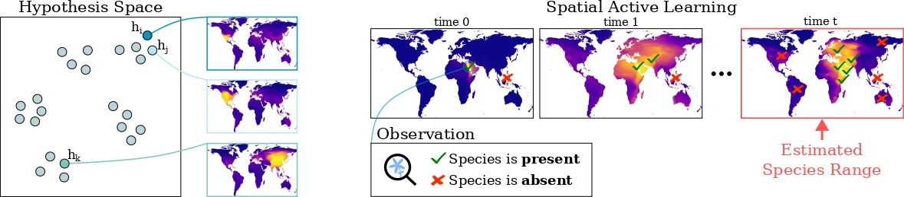

# Active Learning-Based Species Range Estimation - NeurIPS 2023



Code for training and evaluating global-scale active learning based species range estimation models. This code enables the recreation of the results from our NeurIPS 2023 paper [Active Learning-Based Species Range Estimation](). 

## 🌍 Overview

We propose a new active learning approach for efficiently estimating the geographic
range of a species from a limited number of on the ground observations. We
model the range of an unmapped species of interest as the weighted combination of
estimated ranges obtained from a set of different species. We show that it is possible
to generate this candidate set of ranges by using models that have been trained
on large weakly supervised community collected observation data. From this,
we develop a new active querying approach that sequentially selects geographic
locations to visit that best reduce our uncertainty over an unmapped species’ range.
We conduct a detailed evaluation of our approach and compare it to existing active
learning methods using an evaluation dataset containing expert-derived ranges
for one thousand species. Our results demonstrate that our method outperforms
alternative active learning methods and approaches the performance of end-to-end
trained models, even when only using a fraction of the data. This highlights the
utility of active learning via transfer learned spatial representations for species
range estimation. It also emphasizes the value of leveraging emerging large-scale
crowdsourced datasets, not only for modeling a species’ range, but also for actively
discovering them.

## 🔍 Getting Started 

#### Installing Required Packages

1. We recommend using an isolated Python environment to avoid dependency issues. Install the Anaconda Python 3.9 distribution for your operating system from [here](https://www.anaconda.com/download). 

2. Create a new environment and activate it:
```bash
 conda create -y --name active_learning python==3.9
 conda activate active_learning
```

3. After activating the environment, install the required packages:
```bash
 pip3 install -r requirements.txt
```
or
```bash
 conda install -r requirements_conda.txt
```

#### Data Download and Preparation
Instructions for downloading the data can be found in `data/README.md`.

#### Backbone Models

Backbone models used in the paper are ['SINR'](https://arxiv.org/abs/2306.02564) implicit neural representations with all species in either of the evaluation datasets filtered out of the training data.

Instructions for downloading pretrained models can be found in `data/README.md`.

 Code for training SINR models from scratch can be found [here](https://github.com/elijahcole/sinr).

## 🚅 Perform Active Learning and Evaluate

To perform and evaluate an active sampling process, run the following command from within the `active_sampling` directory:
```bash
 python run.py
```

#### Hyperparameters
Common parameters such as `sampling_method` and `update_method` can be set from the command line when calling `run.py`, or by changing the defaults within the `run.py` file. 

All other parameters such as local directory paths may be set in `config.json`. 

#### Outputs
By default, experiment results will be saved to the `results` directory. 

The `generate_figures` directory contains python files to analyse the experiment results and generate the main figures from the paper from them (per timestep MAP plots, per species AP histograms, and visualised range maps with sampled locations).

##  🙏 Acknowledgements
This project was funded by the Climate Change AI Innovation Grants program,
hosted by Climate Change AI with the support of the Quadrature Climate Foundation, Schmidt
Futures, and the Canada Hub of Future Earth. Funding was also provided by the Cornell–Edinburgh
Global Strategic Collaboration Awards.

If you find our work useful in your research please consider citing our paper.  
```
@inproceedings{active_SDM_2023,
  title     = {{Active Learning-Based Species Range Estimation}},
  author    = {Lange, Christian and Cole, Elijah and Van Horn, Grant and Mac Aodha, Oisin},
  booktitle = {NeurIPS},
  year = {2023}
}
```

## 📜 Disclaimer
Extreme care should be taken before making any decisions based on the outputs of models presented here. Our goal in this work is to demonstrate the promise of active learning approaches for species range estimation, not to provide definitive range maps. Our backbone models are trained on biased data and have not been calibrated or validated beyond the experiments illustrated in the paper. 
